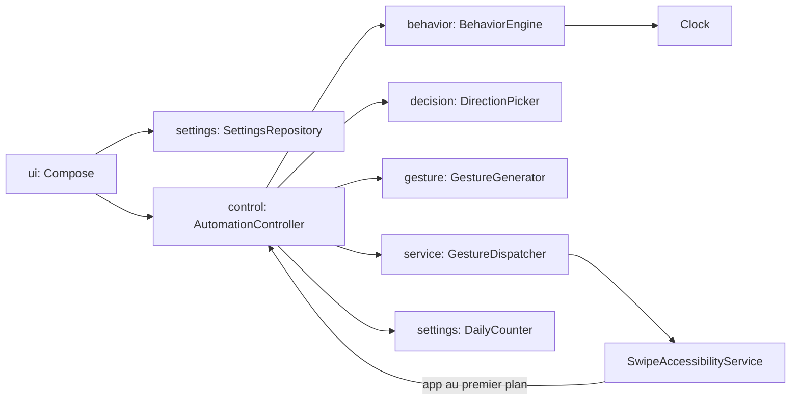
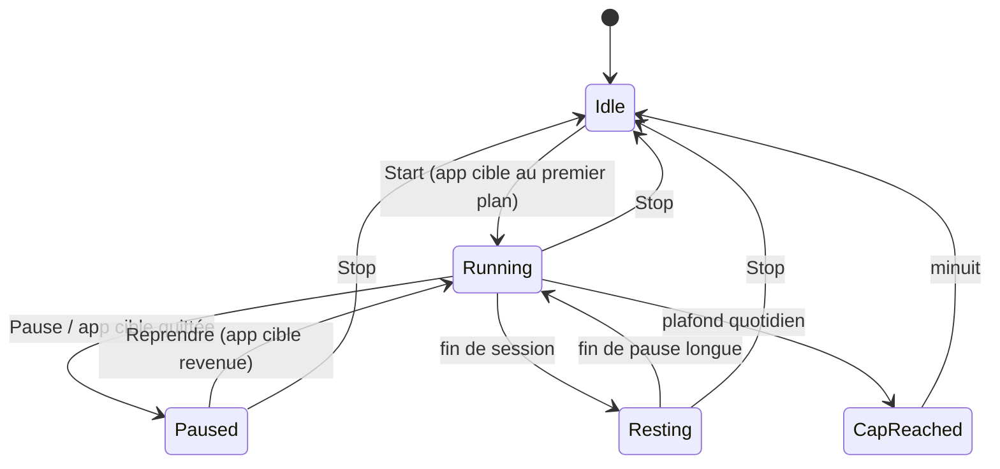
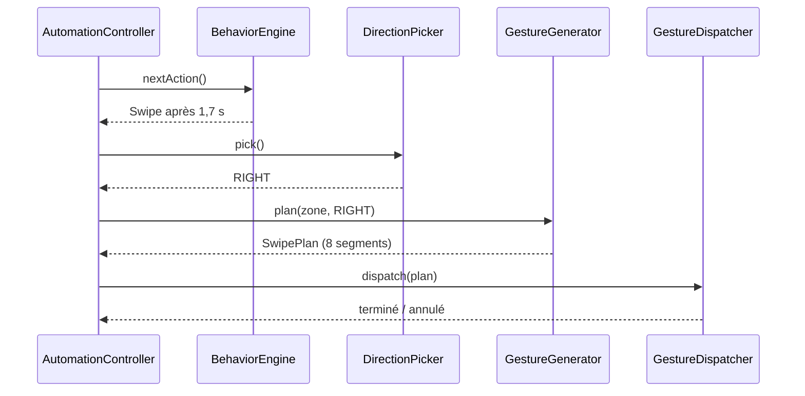

# Diagrammes — Auto-swiper Android

## Composants

```mermaid
flowchart LR
  UI[ui: Compose] --> SR[settings: SettingsRepository]
  UI --> AC[control: AutomationController]
  AC --> BE[behavior: BehaviorEngine]
  AC --> DP[decision: DirectionPicker]
  AC --> GG[gesture: GestureGenerator]
  AC --> GD[service: GestureDispatcher]
  GD --> AS[SwipeAccessibilityService]
  AS -->|app au premier plan| AC
  BE --> CL[Clock]
  AC --> DC[settings: DailyCounter]
```

## États de l'automatisation

```mermaid
stateDiagram-v2
  [*] --> Idle
  Idle --> Running: Start (app cible au premier plan)
  Running --> Paused: Pause / app cible quittée
  Paused --> Running: Reprendre (app cible revenue)
  Running --> Resting: fin de session
  Resting --> Running: fin de pause longue
  Running --> CapReached: plafond quotidien
  CapReached --> Idle: minuit
  Running --> Idle: Stop
  Paused --> Idle: Stop
  Resting --> Idle: Stop
```

## Une itération de la boucle

```mermaid
sequenceDiagram
  participant C as AutomationController
  participant B as BehaviorEngine
  participant D as DirectionPicker
  participant G as GestureGenerator
  participant X as GestureDispatcher
  C->>B: nextAction()
  B-->>C: Swipe après 1,7 s
  C->>D: pick()
  D-->>C: RIGHT
  C->>G: plan(zone, RIGHT)
  G-->>C: SwipePlan (8 segments)
  C->>X: dispatch(plan)
  X-->>C: terminé / annulé
```
